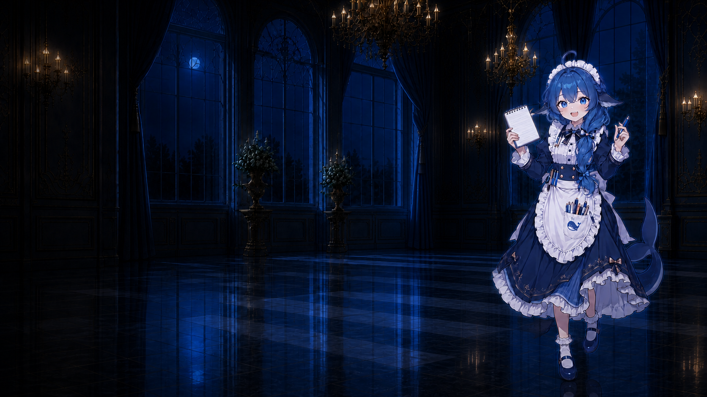

# Codex Deep Whale · DeepSeek 鲸鱼娘主题

把 [dsh-deep-whale](https://github.com/Small-tailqwq/dsh-deep-whale) 的“深海女仆工坊”适配为 [Codex Dream Skin](https://github.com/Fei-Away/Codex-Dream-Skin) 可直接导入的主题包。

本项目只保留一位鲸鱼娘：画面右侧拿笔和本子的女仆角色。提供日间与夜间两个可独立切换的主题，均为 2560 × 1440、左侧留白构图。

| 日间 | 夜间 |
| --- | --- |
|  |  |

## 下载与安装

1. 安装并启动 [Codex Dream Skin](https://github.com/Fei-Away/Codex-Dream-Skin) 1.5.0 或更新版本。
2. 从 [`dist/`](dist/) 下载想要的普通 `.zip` 文件：
   - `codex-deep-whale-maid-day-v1.0.0.zip`
   - `codex-deep-whale-maid-night-v1.0.0.zip`
3. 在 macOS 菜单栏或 Windows 系统托盘选择“导入主题 ZIP…”。
4. 导入成功后，在“已保存主题”中选择对应日间或夜间主题。

主题包包含 Dream Skin 正式包所需的 `manifest.json`、`theme.json`、非空 `theme.css`、唯一背景图和 `LICENSE.txt`，支持 macOS 与 Windows。导入主题不会修改 Codex 官方安装包。

## 原作者与许可

本项目是衍生适配，完整署名链如下：

1. **上善**（[Pixiv](https://www.pixiv.net/users/62155430) · [Bilibili](https://b23.tv/8h5L4xz)）——鲸鱼娘角色形象原作者。
2. **ZipZipPipe / zipzip**（[Pixiv](https://www.pixiv.net/users/18604994) · [Bilibili](https://b23.tv/Pnw6nG8)）——加入 DeepSeek 元素的女仆鲸鱼娘二次设计。
3. **Small-tailqwq**（[原项目](https://github.com/Small-tailqwq/dsh-deep-whale)）——“深海女仆工坊”主题与素材整理。
4. **queshirun** —— Codex Dream Skin 适配、单角色构图与主题包工程。

整体按 **CC BY-NC-SA 4.0** 发布：必须保留完整署名、仅限非商业用途，衍生作品须以相同方式共享。详见 [NOTICE.md](NOTICE.md) 与 [LICENSE](LICENSE)。

本项目不是 OpenAI、DeepSeek、Codex Dream Skin 或上述作者的官方产品，也不表示任何官方背书。

## 开发与验证

在 Windows PowerShell 中重新生成正式 ZIP：

```powershell
./scripts/Build-Packages.ps1
```

使用 Codex Dream Skin 源码中的官方主题校验器同时验证 macOS 与 Windows 契约：

```powershell
./scripts/Test-Packages.ps1 -DreamSkinRoot C:/path/to/Codex-Dream-Skin -NodePath C:/path/to/node.exe
```

所有主题 CSS 只使用 Dream Skin 登记的 `data-ds-part` 部件和 Safe CSS 属性。
